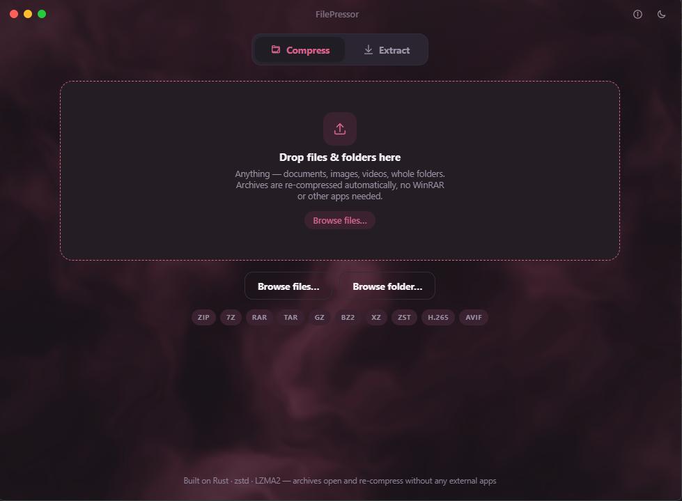

<div align="center">


# FilePressor

### A blazing-fast desktop file compressor — built with Tauri 2, Vue 3 & Rust

Compress files and folders into the smallest possible size, shrink existing
archives, and open almost any archive format — **without installing WinRAR
or any other tool**.

[Features](#-features) ·
[Supported Formats](#-supported-formats) ·
[Download](#-download) ·
[Build from Source](#-build-from-source)

</div>

---



---

## Why FilePressor?

Most compression tools are either slow, bloated, or locked behind a paywall.
FilePressor is different:

- **Tiny & native** — the whole app is a few megabytes and runs as a real
  native window, not a browser tab.
- **Ridiculously fast** — pure-Rust backends and multi-threaded compression
  (zstd uses all your CPU cores) keep things snappy.
- **Smallest output** — choose 7Z (LZMA2) when you want the absolute best
  ratio, or TAR.ZST when you want it done yesterday.
- **It just works** — drop a file, pick a format, hit go. No wizards, no
  clutter, no ads.

## ✨ Features

- **Compress anything** — files, folders, or whole directory trees into:
  - **ZIP** — universal compatibility (opens in Windows Explorer, email, cloud)
  - **7Z (LZMA2)** — the smallest possible output
  - **TAR.GZ** — classic gzip, tiny and fast
  - **TAR.ZST** — zstd, near-instant with great ratios
  - **H.265 (HEVC)** — re-encode video into a tiny, high-quality `.mp4`
  - **AVIF** — convert images to AVIF, smaller than PNG/JPEG at equal quality
- **Re-compress archives** — drop an existing archive (even `.rar`) and
  FilePressor unpacks it internally and rebuilds it in your chosen format.
  Archives containing video/image media are re-encoded to H.265 / AVIF.
- **Open anything** — extracts `zip`, `7z`, `rar`, `tar`, `tar.gz`,
  `tar.bz2`, `tar.xz`, `tar.zst`, `gz`, `bz2`, `xz` and `zst` (matched by
  extension *or* magic bytes, so misnamed files still open).
- **Live progress** with per-file granularity, plus **pause / resume** and
  **cancel** at any time.
- **Beautiful UI** with light & dark themes and a custom macOS-style title bar.
- **Lightweight** — minimal memory footprint, background worker threads, and
  zero runtime dependencies on the user's machine.

## 📦 Supported Formats

| Format        | Open / Extract | Create        | Engine                                  |
| ------------- | -------------- | ------------- | --------------------------------------- |
| ZIP           | ✅             | ✅            | `zip`                                   |
| 7Z (LZMA2)    | ✅             | ✅            | `sevenz-rust`                           |
| RAR           | ✅             | —             | `unrar` (built-in, no WinRAR needed)    |
| TAR / GZ / BZ2 / XZ / ZST | ✅  | TAR.GZ / TAR.ZST | `tar`, `flate2`, `bzip2`, `xz2`, `zstd` |
| H.265 video   | ✅ (open)      | ✅ (re-encode) | `ffmpeg` + `libx265`                    |
| AVIF image    | ✅ (open)      | ✅ (convert)  | `ffmpeg` + `libaom`                     |

> **Media transcoding (H.265 / AVIF)** shells out to an `ffmpeg` binary that
> must be present on `PATH` (or placed next to the executable). Builds without
> those encoders report a clear, friendly error at runtime instead of crashing.

## 🚀 Download

Grab the latest installer for your platform from the
**Releases** page. FilePressor ships as a native, code-signed bundle for
Windows (and other targets via `tauri build`).

## 🛠 Build from Source

You'll need **Rust**, **Node.js**, and **Bun** installed.

```bash
# 1. Install frontend dependencies
bun install

# 2. Run in development mode (hot reload)
bun run tauri dev

# 3. Build a production installer into src-tauri/target/release
bun run tauri build
```

### Using without Tauri (web only)

The frontend can also run standalone for development:

```bash
bun install
bun run dev        # starts the Vite dev server
```

## 📖 How to Use

1. **Compress** — open the *Compress* tab, drag in your files or folders (or
   use the browse button), pick a format and a speed/size level, then press
   **Compress**. Watch live progress and pause or cancel whenever you like.
2. **Extract** — open the *Extract* tab, drop an archive, and FilePressor
   lists its contents. Choose where to save and hit **Extract**.
3. **Re-compress** — just drop an existing archive into the *Compress* tab;
   FilePressor handles the unpack-and-rebuild for you.
4. **Themes** — use the sun/moon button in the title bar to switch between
   light and dark mode.

## 🧱 Project Structure

```
src/                  Vue 3 frontend (panels, drop zones, progress, theming)
└─ components/        TitleBar, CompressPanel, ExtractPanel, ProgressBlock …
src-tauri/            Rust backend
└─ src/
    ├─ archives.rs    format detection, extraction & compression engines
    ├─ tasks.rs       background task runner with progress events
    └─ lib.rs         Tauri commands (analyze, list, compress, extract, cancel)
```

## 🤝 Contributing

Issues and pull requests are welcome. Please open an issue to discuss larger
changes first.

## 📄 License

See the repository for license details.

---

<div align="center">

Made with Rust, Vue & Tauri · Compression without the clutter.

</div>
